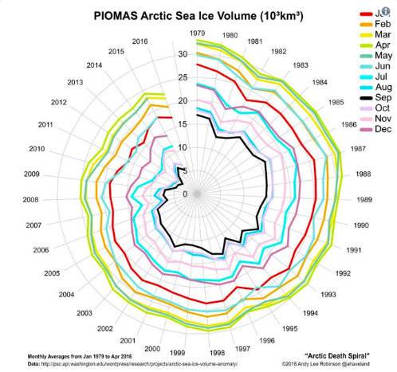

# Self Study Project-Data Visualization of Climate Change
This is the self-study project for Data Visualization 

## Part 1- Evaluate 5 visualizations of climate change
In the first part of this project, there are 5 different data visualiztions of climate change to be explored and evaluated using the following framework. 
Evaluation Framework:
* **Information**
 	A good data visualization should convey information that is clear, accurate and consistent. The data used to generate the visualization should be from a reliable source to establish accuracy.

* **Function**
 	A good visualization should effeciently demonstrate at least one argument.

* **Concept**
 	The argument demonstrated by the visualization should be relevent, meaningful and can be fit into a larger concept (e.g. climate change in this project).

* **Visual Form**
 	A good visualization should have an attractive appearance with a clean structure and harmony in the aesthetics(shapes, colors, ect.)

#### Visualization 1-Carbon Dioxide Emissions vs Vulnerability to Climate Change by Nation
>The Milken Institute School of Public Health created this graphic back in 2015 as a comparison between two data groups. In this visualization, the red circles represent countries which emit the most carbon dioxide.The blue circles represent the countries which are the most vulnerable due to carbon dioxide emission.  The data for this graphic was sourced from the Carbon Dioxide Information Analysis Center.

Read more at https://visme.co/blog/climate-change-facts/#8eYsAoHVfC8owGrc.99

[Image Source](https://mha.gwu.edu/climate-change-emissions-data/)
 **Evaluation** 
 This visualization shows countries with the most emission of carbon dioxide and cantrast with countries that are most vulnarable with climate change. The imformation shown in the visualization is clearly represented. The red circles represent the amount of carbon dioxide emitted by a country and blue circles represent the ND-GAIN index which is a measurement of vulnarability with climate change of a country. It clearly states an argument that countries that have the most CO2 emission are different with countries which are most vulnarable with climate change and the former are mostly developed and fast-growing countries and the latter are mostly developing countries in Africa. The visualization is beautiful with its low-saturation colors and the contrast forms a large circle that is harmonic with all the small circles.  
#### Visualization 2-Global Temperature Changes from 1850-2017

[Image Source](https://mashable.com/2018/01/18/2017-top-3-warmest-years-visualizations-modern-art/#4GBGv5.dyiqQ)
 **Evaluation** 
 This visualization developed by Hawkins mapped global average temperature anomalies from 1850-2017. It is straightfoward to use red to represent temperature that is above average and blue to represent temperature that is below average, the deeper the color, the more extreme the temperature. The graph clearly illustrates that from 1850 to 2017, the global temperature overall has been becoming high. This visualization can be used as persuaive support that the climate change is happening and the global warming is present. However, with similar argument, the graph is not as visually attractive as the warming stripes because there are too many small maps in the same graph.  
#### Visualization 3-Arctic Ice Volume Change

[Image Source](https://www.atlasobscura.com/articles/the-best-visualization-of-climate-change-isnt-a-graphits-a-death-spiral)
 **Evaluation** 
 
#### Visualization 4-Land & ocean temperature records for April, 2016

[Image Source](https://www.atlasobscura.com/articles/the-best-visualization-of-climate-change-isnt-a-graphits-a-death-spiral)

#### Visualization 5-Temperature, CO2 and Sunspots

[Image Source](http://solar-center.stanford.edu/sun-on-earth/FAQ2.html)

## Part 2 Replicate the Warming Stripes
[Data Source](https://www.metoffice.gov.uk/hadobs/hadcrut4/data/current/download.html)

